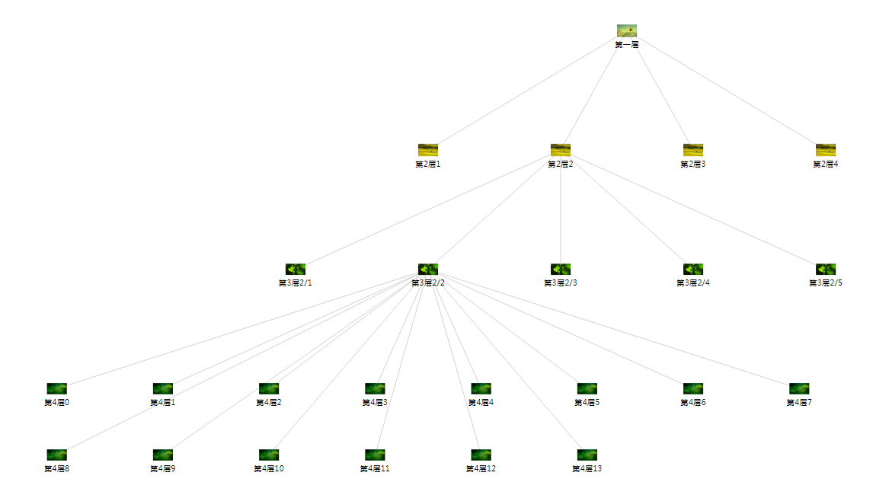

最近接手一个功能，画设备拓扑级联图，最开始使用echart.js完成，但有如下问题：    
1. 当节点过多时，节点描述文本会重叠（网上有解决方案，但效果不是很满意）；    
2. 无法控制子节点超过n个时换行展示；       

在尝试了很多方法效果都不好时，转向了d3.js，完成了该功能，效果图如下：    



> 代码参考： [vue.js中使用D3树状图异步按需加载数据绘制人物关系图](https://www.jianshu.com/p/n2e730n92d42)

实现思路如下：    
1. 数据建模    
数据建模很重要，它直接决定后续代码的复杂度，以下是我的数据建模，仅做参考：
``` javascript
    // 这里位置信息我是分开定义，方便后续筛选数据，其实可以使用一个index中间用 分隔符间隔 来定义的
    {
        "name": "xx",               
        "secondIndex": 0,  // 父节点所属父节点索引
        "thirdIndex": 0,  // 节点所属父节点索引
        "index": 1,  // 节点在本层的横向位置
        "deep": 1, //节点位于第几层
        "totalWidth": 0, //节点总宽度
        "image": '../firstLevel.png', 
        "children": [],
    };
```
2. 实现子节点超过n个时换行展示    
``` javascript
    getFourSelfOffset(d){
        let x = d.x;
        let y = d.y;

        // 节点横向位置
        let rem = (d.index -1) % n;
        // 节点处于第几层
        let lay = parseInt((d.index -1) / n);

        let pX = d.parent.x;
        let pY = d.parent.y;

        let parentChildCount = 0;
        if (d.parent.children) {
            parentChildCount = d.parent.children.length;
        }

        let childCount = parentChildCount > n ? n: parentChildCount;

        if (parentChildCount > 0) {
            x = pX - (childCount - 1) * fourLayWidth / 2 + rem * fourLayWidth;
        }

        if (parentChildCount > n) {
            y = pY + lay * fourLayHeight + layHeight;
        } 

        return {x, y};
    }

    // 这里实现方式有两种，可以直接重置x, y坐标，也可以渲染完成后对节点进行偏移
    // 以下是对节点进行偏移的方式实现
    var nodeEnter = node.enter().append("g")
        .attr("class", "node")
        .attr("transform", function(d) {
            
            let x = source.x;
            let y = source.y0;

            if (d.deep === 4) {
              let selfOffset = that.getFourSelfOffset(d);
              x = selfOffset.x;
              y = selfOffset.y;
            } 

            return "translate(" + x + "," + y + ")"; 
        })
        .on("click", d => that.click(d));
```
    
3. 子节点换行展示后，父节点之间的间距应该缩小，重置所属父节点位置，同理也重置父节点所属父节点的位置    
``` javascript
    // 记录所有已展开的3层节点
    recordThirdExpand(d) {
        if (d.children && !d._children) {
            if (d.children.length > 0) {
                this.expandArr.push(d);
            }
        }

        if (d._children && !d.children) {
            this.expandArr.splice(this.expandArr.findIndex(v => v.secondIndex == d.secondIndex 
                && v.thirdIndex == d.thirdIndex), 1);
        }
    }

    // 重置第3层节点x坐标
    resetThirdLayerNodePosition(d) {
        var that = this

        if (!d.children) {
            return;
        }

        let totalWidth = (d.children.length - 1) * nodeWidth;

        let expand = that.expandArr.filter(v => v.secondIndex == d.secondIndex);
        let min = 0;
        let max = 0;
        if (expand.length > 0) {
            expand.sort(function (a, b) {
                return a.thirdIndex-b.thirdIndex;
            }); 

            min = expand[0].thirdIndex;
            max = expand[expand.length - 1].thirdIndex; 
        } 

        if (expand.length > 1) {
            expand.forEach((item) => {
            if (item.thirdIndex == min || item.thirdIndex == max) {
                let subNodesLength = item.children.length > n ? n : item.children.length;
                totalWidth = totalWidth + (subNodesLength - 1) * fourLayWidth / 2;
            }

            if (item.thirdIndex > min && item.thirdIndex < max) {
                let subNodesLength = item.children.length > n ? n : item.children.length;
                totalWidth = totalWidth + (subNodesLength - 1) * fourLayWidth;
            }
            })
        }

        let minPos = d.x - totalWidth / 2;
        let currentPos = 0;

        d.children.forEach((item) => {
            if (item.thirdIndex == d.children[0].portIndex) {
                item.x = minPos;
            } else {
                let leftNode = d.children.filter(v => v.thirdIndex == item.thirdIndex - 1)[0];
                if (leftNode.children && leftNode.children.length > 0) {
                    if (item.children && item.children.length > 0) {
                        // 前一个节点展开，当前节点也展开
                        let leftCount = leftNode.children.length > n ? n : leftNode.children.length;
                        let currentCount = item.children.length > n ? n : item.children.length;

                        let leftLength = (leftCount - 1) * fourLayWidth / 2;
                        let currentLength = (currentCount - 1) * fourLayWidth / 2;
                        item.x = currentPos + leftLength + currentLength + nodeWidth * 2;
                    } else {  
                        // 前一个节点展开，当前节点未展开
                        let leftCount = leftNode.children.length > n ? n : leftNode.children.length;
                        let leftLength = (leftCount - 1) * fourLayWidth / 2;

                        if (item.thirdIndex == max + 1) {
                            item.x = currentPos + nodeWidth;
                        } else {
                            item.x = currentPos + leftLength + nodeWidth;
                        }
                    }
                } else {
                    if (item.children && item.children.length > 0) {
                        // 前一个节点未展开，当前展开
                        let currentCount = item.children.length > n ? n : item.children.length;
                        let currentLength = (currentCount - 1) * fourLayWidth / 2;

                        if (item.thirdIndex == min) {
                            item.x = currentPos + nodeWidth;
                        } else {
                            item.x = currentPos + currentLength + nodeWidth;
                        }
                    } else {  
                        // 前一个未展开，当前也未展开
                        item.x = currentPos + nodeWidth;
                    }
                }
            }

            currentPos = item.x;
        })
    }

    // 同上还需重新计算第2层节点位置，略

    // update方法中修改代码重置节点x坐标
    let isResetPosition = false;
    nodes.forEach(function(d) {
        d.x = d.x;
        if (d.deep === 3 && !isResetPosition) {     
            that.resetPosition(d.parent.parent);
            isResetPosition = true;
        }
    })
```

